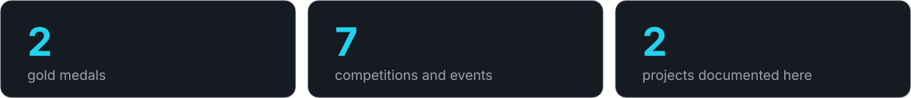
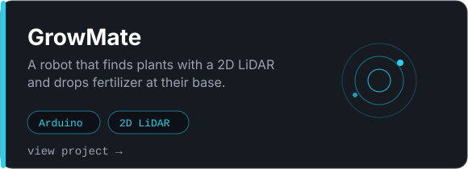
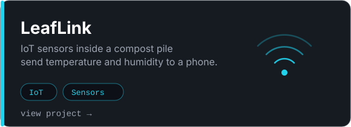

  

 

## 👋 About

I'm an Applied Computer Science student at King Mongkut's University of Technology Thonburi (KMUTT), Bangkok. I got into programming in primary school and I've been competing in coding and robotics events since.

My projects rarely work on the first try, and most of what I know came from fixing them. I like the part where a sketch becomes something that moves, senses or decides.

## 🛠️ What I build

| 🤖 Robotics | 📡 IoT | 🐍 AI-assisted programming |
|---|---|---|
| Mobile robots, sensor wiring and Arduino control code | Sensors that send readings to a phone | Solving problems in Python with AI tools under time limits |

## 🚀 Featured projects

<table>
  <tr>
    <td width="50%" valign="top">
      
      
<b>Problem:</b> Feeding plants one by one by hand is slow, repetitive and uneven. 
      <b>Solution:</b> A tracked robot finds each plant with a 2D LiDAR, circles it and drops pellets 30–50 cm from the trunk. 
      <b>Evidence:</b> Built for Coding Thailand 2025 (Robotics ROS topic, regional round, 26 Sep 2025).

    </td>
    <td width="50%" valign="top">
      
      
<b>Problem:</b> Checking compost quality means walking to the pile and inspecting it. 
      <b>Solution:</b> Temperature and humidity sensors inside the pile send readings to a phone. 
      <b>Evidence:</b> Project write-up in the repo; photos and demo video are coming.

    </td>
  </tr>
</table>

## 🏅 Competitions and recognition

| | Event | Level / date |
|---|---|---|
| 🥇 | Kamalasai AI Robotics and Technology Thailand Championship #10 | National · 28 Jun – 5 Jul 2025 |
| 🥇 | Student Arts and Crafts academic skills competition, game creation with Construct 2 | District · 2025 |
| 🔹 | AMI Hackathon: AI on a robotic arm with CiRA CORE | 3-day national camp |
| 🔹 | Coding Thailand 2025 Regional Coding & AI Competition | 26 Sep 2025 |
| 🔹 | DTS: 10 Wonders of Innovation Exhibition 2025: object sorting with CiRA CORE and a robotic arm | Exhibition · 2025 |
| 🔹 | Thailand Cyber Talent 2025 · Coding Box – High School Edition | Participated |

🥇 gold medal · 🔹 participated

## ⚙️ Tools I've used

    

## 🔭 Where I'm heading

At KMUTT I want to go deeper into programming, AI and mechanical systems, and build projects that people can actually use. Next on my list is putting my past project code and documentation on GitHub.

## 📬 Contact

