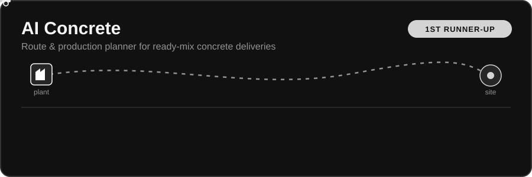
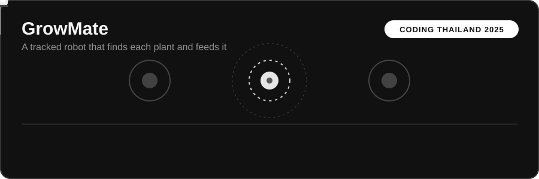
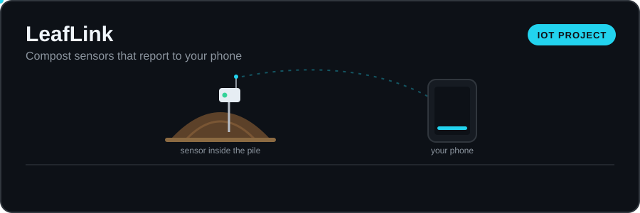

<!-- Header -->

  Applied Computer Science @ KMUTT · Bangkok, Thailand

 

## About me

I'm an **Applied Computer Science** student at **King Mongkut's University of Technology Thonburi (KMUTT)**, Bangkok. I got into programming in primary school and I've been competing in coding and robotics events since.

My projects rarely work on the first try, and most of what I know came from fixing them. I like the part where a sketch becomes something that moves, senses or decides — and lately, the part where a plan is checked against real numbers before anyone trusts it.

## What I build

| Robotics | IoT | Optimization & simulation | UX/UI design | AI-assisted programming |
|---|---|---|---|---|
| Mobile robots, sensor wiring and Arduino control code | Sensors that send readings to a phone | Scheduling and routing plans tested in a simulator before they run | Interfaces, mockups and visuals in Figma and Canva | Solving problems in Python with AI tools under time limits |

## Featured projects

### AI Concrete — route & production planner

**Problem:** A ready-mix concrete company must decide, for every truck trip, which plant loads it, which truck takes it and when mixing starts. Concrete must be poured within 120 minutes, and the staff plan missed customer SLAs on all 4 test days. 
**Solution:** A Python planner that first fixes wrong plant-capacity data, then builds the plan trip by trip, checking every choice against the official simulator, and searches for better options such as asking flexible customers to shift their start time. 
**Evidence:** 1st Runner-Up, AI Hackathon Route Optimization 2026 (AI for Green Logistics). Official evaluator: 4/4 days pass SLA (staff plan 0/4), 96/96 orders on time and continuous, contribution +27% (1.34 → 1.70 M THB), 8% less distance, 0 wasted concrete loads.

<table>
  <tr>
    <td width="50%" valign="top">
      <h3>GrowMate</h3>
      
      
<b>Problem:</b> Feeding plants one by one by hand is slow, repetitive and uneven. 
      <b>Solution:</b> A tracked robot finds each plant with a 2D LiDAR, circles it and drops pellets 30–50 cm from the trunk. 
      <b>Evidence:</b> Built for Coding Thailand 2025 (Robotics ROS topic, regional round, 26 Sep 2025).

    </td>
    <td width="50%" valign="top">
      <h3>LeafLink</h3>
      
      
<b>Problem:</b> Checking compost quality means walking to the pile and inspecting it. 
      <b>Solution:</b> Temperature and humidity sensors inside the pile send readings to a phone. 
      <b>Evidence:</b> Project write-up in the repo; photos and demo video are coming.

    </td>
  </tr>
</table>

## Competitions and recognition

| Result | Event | Level / date |
|---|---|---|
| **1st Runner-Up** | **AI Hackathon Route Optimization 2026 · AI for Green Logistics** (ready-mix concrete delivery planning) | 2026 |
| **Gold medal** | Kamalasai AI Robotics and Technology Thailand Championship #10 | National · 28 Jun – 5 Jul 2025 |
| **Gold medal** | Student Arts and Crafts academic skills competition, game creation with Construct 2 | District · 2025 |
| Participant | AMI Hackathon: AI on a robotic arm with CiRA CORE | 3-day national camp |
| Participant | Coding Thailand 2025 Regional Coding & AI Competition | 26 Sep 2025 |
| Exhibitor | DTS: 10 Wonders of Innovation Exhibition 2025: object sorting with CiRA CORE and a robotic arm | Exhibition · 2025 |
| Participant | Thailand Cyber Talent 2025 · Coding Box – High School Edition | Participated |

## Tech stack

<table align="center">
  <tr>
    <td align="right"><b>Languages &amp; hardware</b></td>
    <td>
      
      
      
      
    </td>
  </tr>
  <tr>
    <td align="right"><b>AI tools</b></td>
    <td>
      
      
    </td>
  </tr>
  <tr>
    <td align="right"><b>Design</b></td>
    <td>
      
      
    </td>
  </tr>
  <tr>
    <td align="right"><b>Workflow &amp; build</b></td>
    <td>
      
      
      
      
    </td>
  </tr>
</table>

## GitHub activity

  
  

  

## Where I'm heading

At KMUTT I want to go deeper into programming, AI and mechanical systems, and build projects that people can actually use. After the route-optimization hackathon I also want to explore optimization for logistics and greener operations. Next on my list is putting my past project code and documentation on GitHub.

## Contact

  
   
  <a href="mailto:natthchai55110@gmail.com">natthchai55110@gmail.com</a>
   
  Happy to talk about projects, hackathons and collaboration.

<!-- Footer -->

